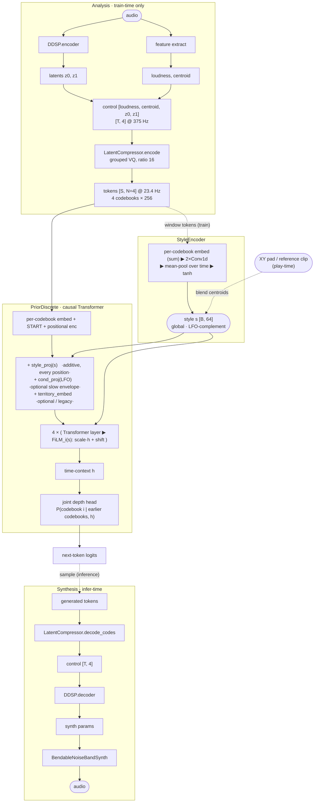

# Discrete Codec Prior — Architecture, Control, Config & nn~

A realtime generative instrument: a DDSP‑VAE synthesiser is driven by a **control trajectory** that is
**compressed to discrete tokens** by a grouped‑VQ codec, and an **autoregressive Transformer prior**
generates those tokens. The prior is **steered by a learned *style* code** (an XY pad that morphs
between the styles in the dataset), with optional slow **LFO** envelopes and **classifier‑free
guidance**. It runs in realtime via a KV cache, exported to `nn~` for Max/MSP.

> **Style is the headline control.** A `StyleEncoder` learns a global style vector per training window;
> at play time you navigate those styles on a 2‑D pad. (An older *territory* label mechanism still
> exists and is interchangeable, but style is the stronger, continuous steering — see §2.)

---

## 1. Architecture



At **play time** the style code `s` does **not** come from the encoder — it comes from the **XY pad**
(a blend of the per‑track style centroids, §3) or from a reference clip. The encoder is only used at
train time (and offline, to build the pad's centroids).

**Stages**

| Component | Role | Key params (current `mixed_rt16`) |
|---|---|---|
| `DDSP` (`ddsp/ddsp.py`) | VAE synth: encoder (audio→latents), decoder (control→synth params), `BendableNoiseBandSynth` | `resampling_factor=128` → control rate **375 Hz**; `decoder_temporal_stride=4` (linear upsampling, click‑fix) |
| `LatentCompressor` (`ddsp/latent_compressor.py`) | grouped‑VQ codec over the control sequence; **codes‑only decode** (`use_skip_connections=false`) | `compression_ratio=16` → token rate **23.4 Hz** (≈43 ms/token); `strides=[4,2,2]`, `num_codebooks=4`, `codebook_size=256` |
| `StyleEncoder` (`ddsp/prior/prior_discrete.py`) | window tokens `[B,S,N]` → global **style code** `[B, style_dim]`; mean‑pooled (no positions) so it carries texture/rhythm/grain, not content | per‑codebook embed (sum) → `2×Conv1d(k5)+ReLU` → mean‑pool → `Linear` → `tanh`; `style_dim=64` |
| `PriorDiscrete` (`ddsp/prior/prior_discrete.py`) | causal Transformer over `[S,N=4]` tokens + style/LFO conditioning + joint codebook head | `d_model = embedding_dim(64) × num_codebooks(4) = 256`, `nhead=8`, `num_layers=4`, `max_len=256` (≈11 s @ 23.4 Hz) |
| `KVCachedPrior` (`ddsp/prior/kv_infer.py`) | incremental, KV‑cached equivalent of `PriorDiscrete.forward` (batch=1, scriptable); carries the style proj + per‑layer FiLM | weights mapped from the trained prior; parity ≈ 1e‑5 (with style ≈ 2e‑5) |
| `PriorDiscreteWrapper` (`cli/export.py`) | realtime nn~ wrapper: token loop, streaming compressor decode, **style XY‑pad map**, style‑CFG, smoothing, reseed | builds the `[0,1]` style map + auto blend temperature at export |

**Control vector** = `[loudness, centroid, latent0, latent1]` (`num_controls = feature_dim + latent_size = 4`).

---

## 2. Conditioning mechanisms

### Style (the main steering) — *learned, continuous*
A `StyleEncoder` maps each training window's tokens to a global **style code** `s ∈ ℝ⁶⁴` (tanh‑bounded,
time‑pooled so it captures *style*, not content). `s` is injected into the prior **two ways**:

- **additive at the input** — `style_proj(s)` added to every position's embedding, and
- **per‑layer FiLM** — after *each* Transformer layer, `h ← (1 + γ_i(s))·h + β_i(s)`.

This dual, per‑layer injection (vs. a single weak additive bias) is what makes style **load‑bearing**
during free‑running generation. Training levers:

- **`style_dropout`** (0.2) — zero `s` for a fraction of windows ⇒ a learned **null** style, enabling
  **style‑CFG** (below).
- **`style_aux_weight`** (0.3) — an auxiliary head classifies the source track from `s`, forcing the
  style space to be maximally **separable** (so pad zones are distinct).
- **`context_dropout`** / **scheduled sampling** (`ss_iters`) — robustness knobs. `context_dropout`
  forces reliance on `s` but *compresses dynamics if left on*, so the shipped model sets it **0** and
  uses **iterated scheduled sampling** (`ss_iters=3`) instead, which exposes the model to its own
  drifted context and keeps loudness dynamics from flattening at free‑run.

Why style over the old territory labels: territory is a handful of discrete additive biases; style is
a rich continuous code with per‑layer FiLM, so it actually *relocates* generation between styles
(reach 12/12 tracks) instead of just tinting it.

### LFO / cond envelope — *slow scaffold (optional)*
The control low‑passed (`cond_smooth_frames=64`) at token rate, projected by `cond_proj` and added at
every position — a slow per‑channel curve the prior fills in around. `cond_dropout` makes it
**switchable** (feed `0` = freeform). On the current groovy codec the LFO is a gentle macro modulator
(the beat is generated intrinsically); pushing it hard can loosen the groove. *Still wired in nn~.*

### Classifier‑free guidance (CFG) — *contrast / commitment knob*
With a learned null (`style_dropout>0` for style, or `cfg_dropout>0` for territory), a second pass runs
in lockstep and logits are guided `uncond + scale·(cond − uncond)`. For style this is **Style‑CFG**:
how hard to commit to the pad's style. See §3.1 for settings.

### Joint codebook head (WS4) — *on‑manifold sampling*
Instead of sampling the 4 codebooks independently (off‑manifold → clicks), a small **depth head**
predicts codebook `i` from the time‑context `h` and the already‑decoded codebooks `<i` (parallel
prefix‑sum in training, N sequential steps at inference).

### ⚠️ Token rate is groove‑critical
A beat at ~125 bpm is one event every ~0.48 s. At the **43 ms** codec that's ~11 tokens/beat — the
prior can *generate* a stable groove. At the older **200 ms** codec it's only **2.4 tokens/beat**
(below the token‑grid Nyquist), so a generative model can't hold the phase and the **groove "comes and
goes."** The 200 ms codec reconstructs fine but cannot *generate* groove — use the **43 ms** codec
(`strides=[4,2,2]`) for any rhythmic material. (Steady 4/4 grooves lock; very sparse/irregular grooves
are still the hard case.)

---

## 3. Realtime control surface (nn~ `prior` method)

Inputs are signal‑rate channels (a "knob" is a signal). Current model = **10 inputs → 4 control out**:

| # | label | meaning |
|---|---|---|
| 1–4 | `LFO 1..4` | optional slow control‑envelope scaffold (loudness, centroid, latent0, latent1). `0` = off/freeform |
| 5–6 | `Style X / Y` | **2‑D style pad, each axis `0…1`**. Blends the per‑track style centroids (corners = extreme styles) |
| 7 | `Temperature` | sampling randomness (≈0.5 locked … 1.0 varied; ~0.6 default) |
| 8 | `Style CFG` | how hard to commit to the pad's style (1 = raw … see §3.1) |
| 9 | `Smoothing` | causal one‑pole LPF on **all** control trajectories (0 = off … ~0.95 = sluggish glide) |
| 10 | `Reseed Trigger` | rising edge >0.5 re‑anchors the prior to a fresh phrase (beat‑sync restart) |

(If a model is exported with territory instead of style, channels 5–6 become `Territory X/Y` and 8 is
`CFG Strength`; the layout is otherwise identical.)

**The Style pad.** Built at export from the per‑track **style centroids** (mean of `StyleEncoder` over
each track's windows), reduced to 2‑D by PCA and **normalised so each axis is `0…1`** (corners are
literal). The runtime blend is `softmax(−dist² / style_temp)` over the centroids, with `style_temp`
**auto‑derived** from the centroid spacing (`0.5 × mean‑nearest‑neighbour‑dist²`) — so it's correct
for *any* dataset/track‑count with no manual tuning. For the current model the **X axis ≈ textures (0)
→ beats (1)**; sweeping the pad between two points morphs continuously (e.g. beat → texture).

### 3.1 CFG (and temperature) guidance
Measured on the current groovy model — higher CFG sharpens style identity but **collapses diversity and
loosens the groove**:

| Style CFG | use |
|---|---|
| **1.0 – 1.5** | **default for rhythmic material.** Best groove; the pad still moves clearly between styles (the family axis is carried by pad position, not CFG). |
| **~2.0** | most distinct *within‑family* style identity; groove a little looser. Good when you want styles to pop. |
| **≥ 3.0** | exaggerated A/B style switching, but groove degrades / gets repetitive — **avoid for beats**; fine for textures (no groove to lose). |

Start at **CFG 1.5, Temperature 0.6**. If you push CFG up, **raise Temperature** (~0.8) to claw back
diversity (high‑CFG + low‑temp is the most collapse‑prone combo).

---

## 4. Config (`prior` section)

Everything is config‑driven. Canonical block (current style model):

```yaml
prior:
  enabled: true
  discrete:
    enabled: true
    compressor_ckpt: null         # auto-train/locate if null

    # ── style (the main steering) ──
    style_dim: 64                 # >0 enables the StyleEncoder + XY pad
    style_dropout: 0.2            # learned null style ⇒ Style-CFG capable
    style_aux_weight: 0.3         # track-classification aux ⇒ separable style space

    # ── generation robustness (keep dynamics, avoid drift) ──
    context_dropout: 0.0          # 0 on the shipped model (>0 compresses loudness dynamics)
    ss_prob: 0.3                  # iterated scheduled sampling: feed the model its own drifted context
    ss_iters: 3                   # >1 = multi-step drift (fixes free-run dynamics flattening)
    ss_anneal_steps: 4000

    # ── LFO / envelope conditioning (optional scaffold) ──
    cond_envelope: true
    cond_smooth_frames: 64
    cond_dropout: 0.5             # feed 0 to the LFO inputs = freeform

    # ── legacy territory + guidance + sampling head ──
    num_territories: 12           # per-track labels (used for the style-aux classes; pad uses STYLE)
    terr_by_track: true
    cfg_dropout: 0.15             # CFG-capable (territory); style-CFG uses style_dropout
    joint_codebooks: true         # depth head (on-manifold; kills codebook-independence clicks)

    # ── nn~ wrapper (export-time) ──
    terr_map_temp: 0.5            # legacy territory-map sharpness (style temp is auto-derived)
    decode_lookahead: 2           # streaming-decode lookahead (tokens of latency)

  model:                          # Transformer
    embedding_dim: 64             # d_model = embedding_dim × num_codebooks = 256
    nhead: 8
    num_layers: 4
    dim_feedforward: 1024
    dropout: 0.0
    max_len: 256                  # ≈11 s context @ 23.4 Hz (KV cache makes this realtime)

  dataset:
    stride_factor: 0.004
    respect_boundaries: true      # windows never cross track boundaries
    in_memory: true

  training:
    batch_size: 64
    max_epochs: 10000             # cap steps with PRIOR_MAX_STEPS env (≈50k is the sweet spot here;
    lr: 5e-4                      #   ~100k overtrains and regresses groove/reach)
    val_fraction: 0.0
```

The codec lives under the sibling `compressor:` section. **Use `strides=[4,2,2]` (=16, 43 ms/token)**
for rhythmic material — see §2's token‑rate note. The coarse `[5,5,3]` (=75, 200 ms) variant captures
whole drum hits as atomic vocabulary but **cannot generate a stable groove**.

---

## 5. Train & export

```bash
# 1. synth (DDSP)            → training/synth/<name>
python cli/train.py        --config-name <name>
# 2. compressor + prior      → training/compressor|prior_discrete/<name>   (compressor auto-trains)
PRIOR_MAX_STEPS=50000 python cli/train_prior.py --config-name <name>
# 3. export to nn~           → models/<name>.ts   (computes the style centroids + XY map automatically)
python cli/export.py       --config <name> --prior_checkpoint training/prior_discrete/<name>/<run>/<ckpt>
```

The synth is dataset‑specific (it defines the latent space); the compressor and prior sit on top.
Reuse a synth/compressor across prior variants via symlinks under `training/` (e.g.
`training/synth/<variant> → <base>`). `--prior_checkpoint` overrides the default `best_acc` auto‑pick
(use it to ship the ~50k sweet‑spot checkpoint rather than an overtrained one).

### nn~ integration
`cli/export.py` wraps the models in `ScriptedDDSP` (an `nn_tilde.Module`) exposing:

- **`encode`** — audio → control (analysis).
- **`decode`** — control → audio (the synth; streaming).
- **`prior`** — the 10‑channel control surface above → control, at the synth's resampling ratio.

In Max, drive `prior` with your control signals and feed its output to `decode`. State (KV caches,
token buffer, smoothing, reseed) persists across audio blocks; cold start is the learned START token.
The **style XY‑pad map is baked into the exported model** (per‑track centroids + auto blend temp), so
nothing about style needs to be configured in Max — just move X/Y in `0…1`.

**Realtime.** The current model benches **≈11.8× realtime** for token generation (CPU, single thread)
at 23.4 tok/s. The 200 ms codec has more headroom (≈4.7× fewer tokens) but cannot groove.

---

## 6. LFO generator (2nd hierarchy level)

Instead of hand‑drawing the LFO, a small coarse model can **generate** it. `scripts/lfo_generator.py`
k‑means‑quantises the fine prior's stored cond envelopes (`cond:{idx}`) and trains a 1‑codebook
`PriorDiscrete` over those envelope tokens, then samples a plausible LFO trajectory and feeds it to the
fine prior as `cond` (with `--lfo_cfg` for grip). A working two‑level hierarchy (coarse plans the
scaffold, fine renders it); no change to the fine prior or its nn~ export is needed — the integration
point is the existing `cond` input. On the 43 ms groovy model this is optional (groove is intrinsic);
it's most useful for long‑form macro shaping.
